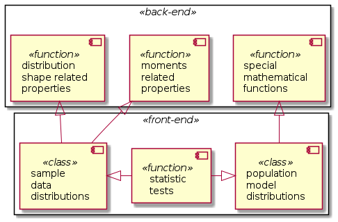

# Intended use, functionality and general design of the library statistics_lib

## Purpose of the library

There are a lot of very powerful Python libraries for statistical computations, for example, [SciPy](https://scipy.org/), [Pingouin](https://pingouin-stats.org/index.html) or [Statsmodels](https://www.statsmodels.org/stable/index.html). Basically, these libraries are designed to compete with the specialized statistics software like [SPSS](https://www.ibm.com/products/spss-statistics) or its Open Source counterpart [PSPP](https://www.gnu.org/software/pspp/), or even with specialized programming languages like now defunct [S](https://en.wikipedia.org/wiki/S_(programming_language)) or its very alive Open Source descedant [R](https://www.r-project.org/). These libraries provide rich functionality including a large choice of the statistical tests, statistical models and even regression analysis tools; also they are optimized for the 'big data'. Being such an 'army swiss knife' comes with a price: these libraries are large in size and hard to master, and, often, they have many dependencies.

In many cases, e.g. production quality control, such libraries are 'overkill', especially considering their emphasis on the *inferencial* (predictive) statistics, whereas just few simple tests based on the *descriptive* statistics are all what is required. Thus, the current library *statistics_lib* is designed with the following goals in mind:

* Simple API
  * Functionality is limited to the *descriptive* statistics of the input data and a number of simple tests based on the statistical properties of the data concerning the sample's mean and variance
  * No support for file / stream IO
  * Input data format is limited to the sequences of numerical data - as Python built-in or custom defined types
* Small footprint (size of the library)
* Minimal number of dependencies (from the same developer) and zero 3rd party libraries policy
* Not designed for 'big data' but small to medium sized samples / population (10s to 1000s data points)
* Intended use
  * 'Stand-alone' tool for quick analysis of data
  * Included part of other tools, which rely on basic statistics methods and are installed and executed in 'sand-boxed' / container-like environment
* Support for the 'measurements with uncertainty' data, i.e. when all or some data points are not exact numbers, but the results of some measurements represented by the most probably (mean) value and the corresponding uncertainty (experimental error) pairs; see, for instance, [phyqus_lib](https://github.com/FooBarShebang/phyqus_lib)
* Enhanced exceptions handling and logging functionality for the computation process control and debugging; see [introspection_lib](https://github.com/FooBarShebang/introspection_lib)

## Intended functionality

The following functionality is to be implemented:

* Analysis of the shape of distribution of the input data
  * Calculation of moment and cross-moment related properties, including arithmetic mean, variance and standard deviation, skewness, kurtosis, covariance and Pearson's correlation coefficient
  * Calculation of the properties of the ordered, sorted data, including min, max, median, mode(s), quantilies, ranks and histogramms, Spearman and Kendall rank correlation coefficients
  * Comparison of the data distribution shape with:
    * Generic Gauss (normal) distribution $\mathbb{N}(\mu,\sigma)$, including Z-distribution distribution $\mathbb{Z} = \mathbb{N}(0,1)$
    * Student`s t-distribution
    * $\chi^2$-distribution
    * F-distribution
    * Poisson distribution
    * Binomial distribution
* Basic statistic tests
  * For the mean value(s)
    * Z-test
    * Student's t-test (paired and independent samples)
  * For the variance(s)
    * $\chi^2$-test
    * F-test
    * Levene's test
    * Brown-Forsythe test
    * Barlett's test

## General design and components of the library

Considering the statistic tests as the major mode of the library use the functions or classes implementing the tests are the *front-end* of the library. In general, the tests listed above calculate a *test value* from specific statistical properties of the data sample and the probability of observation of values larger or smaller than the calculated under the assumption (null hypothesis) that the value being tested follows a specific distribution. The calculation of such probability values involves special mathematical functions, from which only few are implemented in the Standard Python Library. Thus, those special mathematical functions and the functions to calculate the statistical properties of the input data sample are the *back-end* of the library.

The object-oriented programming concept of data encapsulation is a convenient method to implement the abstraction layer between and front- and back-ends of the library. For instance, Z-test compares the sample's mean with the model normal distribution with known variance and mean values. Thus, there are two possibilities for the implementation:

* Allow an end-user to access the back-end functionality in order to calculate the sample's mean and the standard error of the mean, which approach violates the idea of the front- and back-ends separation
* OR, pass the sample data into the test function and implement the calculation of the samples' statistical properties inside the test function

The second approach is clearly preferable from the front- and back-ends separation point of view, but is more likely excibit buggy behaviour or result in a run-time error / exception in the case of the unexpected or improper input. However, instead of working directly with the unpredictable input data sequence it can be encapsulated into a 'sequence on steroids' class instance, which takes care of the input data sanity check during instantiation an provides the data statistical properties 'on demand' via properties or methods. Furthermore, such encapsulation provides control over data modification. Thus, the test functions do not have to worry about the input data.

The object-oriented approach is also very convenient for the implementation of the model distributions. The model distributions mentioned above are characterized by just few parameters, which can be stored as the class state, whereas the statistical properties as well as PDF, CDF and quantile functions can be calculated directly from these parameters, thus can be implemented as methods.

Both the 'sample data' and 'model population' classes should provide compatible, nearly identical API (set of data attributes, properties, methods) except for the properties or methods which make no sense for the respective class. This approach should facilitate the comparison of the shape and statistical properties of different 'sample data' with each other as well as to the model distributions.

The components diagram below illustrates the proposed design of the library.

