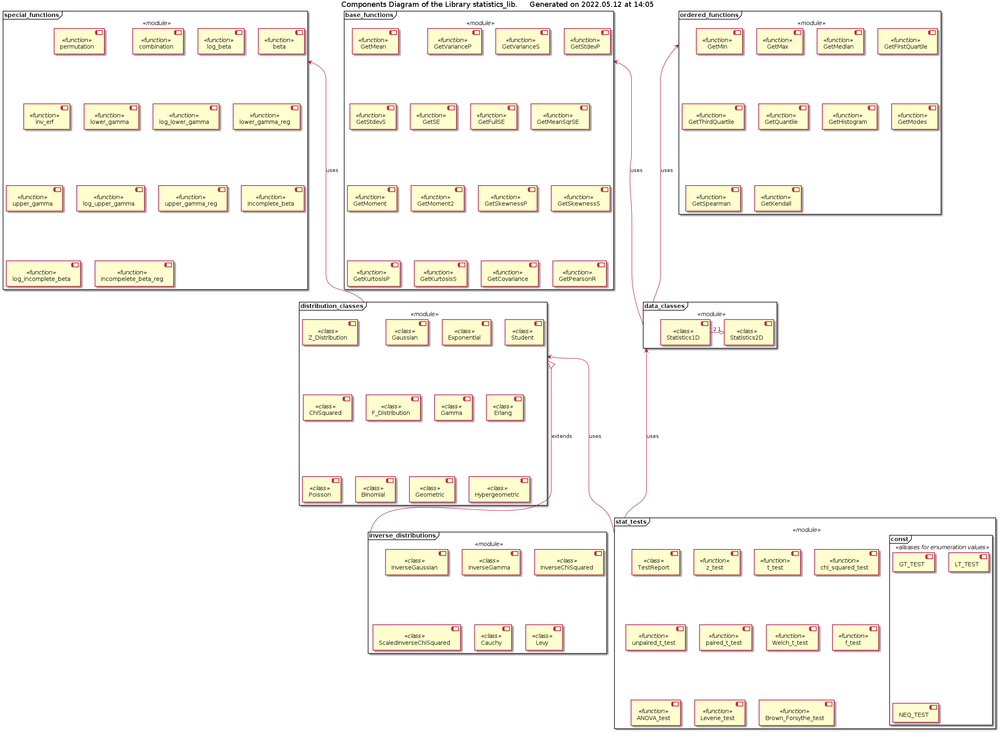

# Library statistics_lib Reference

## Scope

This document provides the reference infomation on the library *statistics_lib*, which includes the following modules:

* *base_functions*
* *ordered_functions*
* *special_functions*
* *data_classes*
* *distribution_classes*
* *inverse_distributions*
* *stat_tests*

## Installation

This library can be check-out from the GitHub [repository https://github.com/FooBarShebang/statistics_lib](https://github.com/FooBarShebang/statistics_lib). The recommended manner of use is within a *virtual environment*. The recommended location is *Lib/site_packages* within the virtual enviroments.

**Important**! Do not forget to check-out the dependencies into the same location side by side with *statistics_lib*:

* [introspection_lib](https://github.com/FooBarShebang/introspection_lib)
* [phyqus_lib](https://github.com/FooBarShebang/phyqus_lib)

## Intended Use and Functionality

The library is intended to be used for the simple statistical analysis, including:

* Analysis of the statistical properties of the sample(s) and correlation between samples - module *data_classes*
* Comparison of the samples date distribution to each other and / or some model random distributions - modules *data_classes*, *distribution_classes* and *inverse_distributions*
* Performance of the statistical significance testing - modules *stat_tests* and *data_classes*

The pseudo-code below illustrates some intended uses of the library.

```python
from statistics_lib.data_classes import Statistics2D
from statistics_lib.distribution_classes import Gaussian
from statistics_lib.stat_tests import NEQ_TEST, unpaired_t_test, f_test
...
#suppose, that we have two data samples of the same length as DataX and DataY
#let's put it into a nice container with the analysis functionality
Data = Statistics2D(DataX, DataY)
#optionally - let's assign identifiers to the data
Data.Name = 'My experimental data' #assign some identifier/descriptor to the set
Data.X.Name = 'Predictor - thermometer' #X-data identifier
Data.Y.Name = 'Predicted - barometer' #Y-data identifier
#print-out the detailed statistical properties analysis report on the 2D set
print(Data.Summary)
#the individual values are accessible as Data.Pearson, Data.X.Mean, Data.Y.Var
#etc.
#it is possible to compare the shapes of the samples distribution directly
HistX = Data.X.getHistogram(NBins = 11) #make 11 bins, default is 20
HistY = Data.Y.getHistogram(NBins = 11)
#now, they can be plotted side by side - as two sequences of (x, y) coordinates
#or, they can be compared with a model distribution
ModelX = Gaussian(Data.X.Mean, Data.X.Sigma)
ModelHistX = ModelX.getHistogram(Data.X.Min, Data.X.Max, 11)
ModelHistX = ((Pos, Value * Data.X.N) for Pos, Value in ModelHistX)
#normalize to the model distribution to the number experimental data points
#+ also, one can make Q-Q plots data X vs Y
QQ_Data = [[Data.X.getQuantile(k, 100), Data.Y.getQuantile(k, 100)]
                                                        for k in range(1, 100)]
#or model vs X
QQ_Model = [[ModelX.getQuantile(k, 100), Data.X.getQuantile(k, 100)]
                                                        for k in range(1, 100)]
#one can also compare the samples' mean values - unequal at 95% confidence
Test = unpaired_t_test(Data.X, Data.Y, NEQ_TEST)
print(Test.Report)
#or compare the sample's variances - unequal at 90% confidence
Test = f_test(Data.X, Data.Y, NEQ_TEST)
print(Test.Report)
...
```

The unique feature of this library that any sequence consisting of a mixture of real numbers (Python types **int** and **float**) and / or *measurements with uncertainty* (instances of a class API compatible with **MeasuredValue** class from [phyqus_lib](https://github.com/FooBarShebang/phyqus_lib)) can be used as the input data. The data encapsulating class **Statistics1D** (*Data.X* and *Data.Y* in the example above) can calculate varaince and standard deviation including and excluding the measurement uncertainty of the individual data points within the sample. The statistical significance testing functions automatically account for the influence of the individual data points uncertainty (measurement error) on the expected total variance.

Additionally, the classes defined in the modules *distribution_classes* and *inverse_distributions* can be used in the Monte-Carlo simulations in order to provide random variables distributed according to a speific law / model.

## Design and Implementation

The components diagram of the library is shown below.



Basically, the modules *base_functions*, *ordered_functions* and *special_functions* form the back-end of the library. The end-users, clients of the library are not discouraged from using them directly, in fact, it may be even required in some situations. However, the library is desigend mostly under assumption that the library clients use the front-end modules *data_classes*, *distribution_classes* and *stat_tests* (as in the example in the previous section). The remaining module *inverse_distriutions* is, in a sense, extras, not required for the functionality of the other modules, and which is provided only for occassional usage by the library's clients.

Each of the library's modules is responsible for / implements specific functionality:

* Module *base_functions* - calculation of the moment-related statistical properties of the finite length sample(s), including Pearson's correlation coefficient
* Module *ordered_functions* - calculation of the statistical properties of the samples related to the order / sorting of the data points, including median, quartiles and quantiles, as well as the Spearman and Kendall correlation
* Module *special_functions* - implementation of the special mathematical functions as inverse standard error, incomplete beta and gamma functions, etc. - used for the calculation of the PDF, CDF and QF of the model random distributions
* Moule *data_classes* - classes providing encapsulation of the experimental data and clean, simple OOP API for the calculation of the statistical properties
* Module *distribution_classes* - classes implementing the most commonly used random distributions, including Gaussian, Student's t-distribution, chi-squared, Gamma and F-distributions, providing OOP API highly compatible with this of the classes in the module *data_classes*
* Module *inverse_distributions* - some additional random distributions, mostly inverse (multiplication / division reciprocal), following exactly the same OOP API convention
* Module *stat_tests* - functions implementing the basic statistical significance testing, inclduing z-test, one sample t-test, unpaired and paired two samples Student's t-test, chi-squared test on the sample variance and F-test on the samples' variances

## API Reference

The reference documentation on the specific modules, including design and implementation specifics and API is provided in the separate files - see links below.

* Module [base_functions](./UD001_base_functions.md)
* Module [ordered_functions](./UD002_ordered_functions.md)
* Module [data_classes](./UD003_data_classes.md)
* Module [distribution_classes](./UD004_distribution_classes.md)
* Module [special_functions](./UD005_special_functions.md)
* Module [inverse_distributions](./UD006_inverse_distributions.md)
* Module [stat_tests](./UD007_stat_tests.md)
