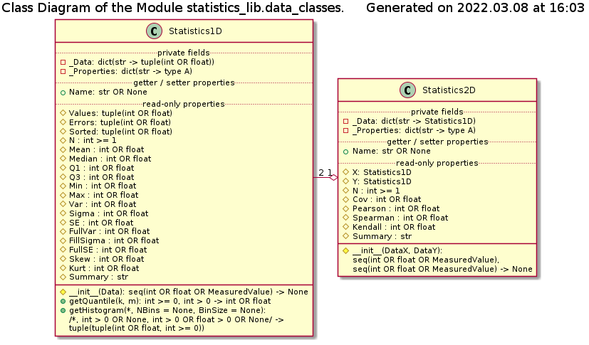

# Module statistics_lib.data_classes Reference

## Scope

This document describes the intended usage, design and implementation of the functionality implemented in the module **data_classes** of the library **statistics_lib**. The API reference is also provided.

The concerted functional elements are classes:

* **Statistics1D**
* **Statistics2D**

## Intended Use and Functionality

This module implements 'sequence on steroids' classes to perform basic statistics analysis of sequence(s) of the results of measurements with the associated uncertainties / expertimental errors. The exact values w/o an associated uncertainty (i.e. **int** or **float** type) are treated as measurements with zero uncertainty.

The classes provided in this module implement the following functionality:

* Immutability of the stored data - the values of each individual data points can be read-accessed, but not modified or removed, as well as new data points cannot be added
* Improved calculation speed - previously accessed statistical properties are cached and not re-calculated upon the consequent request
* Easy and convenient API - the statistical properties of the data sequence are accessible via read-only properties, instead of function or method call

The base design idea is that the entire data set is treated and passed around as a single object, which can calculate the own statistical properties. Thus, the API of such objects can made compatible / mostly similar to the classes implementing model continuous distributions. Therefore the functions performing statistical comparison can operate in the same manner on the measured (finite size samples) data and model distributions. Also, this approach simplifies implementation of the statistical tests functions.

## Design and Implementation

## API Reference

## Class Statistics1D

 Data storage class encapsulating 1D data set and ensuring its immutability. The statistical properties are calculated 'on demand', cached and interfaced via read-only properties (attributes).

Must be instantiated with one sequence of (a mix of) real numbers or instances of classes implementing 'measurements with uncertainty' of the same length.

_**Properties**_:

* _Name_: **str**; arbitrary identifier of the data set
* _Values_: (read-only) **tuple**(**int** OR **float**); the stored 'mean / most probable' values of the data set
* _Errors_: (read-only) **tuple**(**int** >= 0 OR **float** >= 0); the stored 'errors / uncertainties' values of the measurements in the data set
* _Sorted_: (read-only) **tuple**(**int** OR **float**); the stored 'mean / most probable' values of the data set, sorted in the ascending order
* _N_: (read-only) **int** > 0; the length of the data set (number of points)
* _Mean_: (read-only) **int** OR **float**; the arithmetic mean of the stored data
* _Median_: (read-only) **int** OR **float**; the median value of the stored data
* _Q1_: (read-only) **int** OR **float**; the first quartile of the stored data
* _Q3_: (read-only) **int** OR **float**; the third quartile of the stored data
* _Min_: (read-only) **int** OR **float**; the minimum value within the stored data
* _Max_: (read-only) **int** OR **float**; the maximum value within the stored data
* _Var_: (read-only) **int** >= 0 OR **float** >= 0; the (population) variance of the data set
* _Sigma_: (read-only) **int** >= 0 OR **float** >= 0; the (population) standard deviation of the data set
* _SE_: (read-only) **int** >= 0 OR **float** >= 0; the (population) standard error of the mean of the data set
* _FullVar_: (read-only) **int** >= 0 OR **float** >= 0; the (population) full variance of the data set, including the contribution of the measurements uncertainties
* _FullSigma_: (read-only) **int** >= 0 OR **float** >= 0; the (population) full standard deviation of the data set, including the contribution of the measurements uncertainties
* _FullSE_: (read-only) **int** >= 0 OR **float** >= 0; the (population) full standard error of the mean of the data set, including the contribution of the measurements uncertainties
* _Skew_: (read-only) **int** OR **float**; the (population) skewness of the stored data
* _Kurt_: (read-only) **int** OR **float**; the (population) excess kurtosis of the stored data
* _Summary_: (read-only) **str**; the summary of the statistical properties of the data set

_**Instantiation**_

**\_\_init\_\_**(Data)

_Signature_:

seq(int OR float OR phyqus_lib.base_classes.MeasuredValue) -> None

_Args_:

_Data_: **seq**(**int** OR **float** OR **phyqus_lib.base_classes.MeasuredValue**); generic sequence of the measurements data to be stored

_Raises_:

* **UT_TypeError**: argument is not a sequence of real numbers or measurements with uncertainty
* **UT_ValueError**: passed sequence is empty

_Description_:

Initialization method. Perfroms the input data sanity check, extaction of the 'means' and uncertainties of the measurements, and encapsulation of the data.

_**Methods**_:

**getQuantile**(k, m)

_Signature_:

0<= int k <= int m -> int OR float

_Args_:

* _k_: **int** >= 0; the quantile index, between 0 and m inclusively
* _m_: **int** > 0; the total number of quantiles

_Raises_:

* **UT_TypeError**: quantile index is not an integer, OR the total number of quantiles is not an integer
* **UT_ValueError**: the total number of quantilies is negative integer or zero, OR the quantile index is negative integer or integer greater than the total number of quantiles, OR the stored sequence is of length 1

_Description_:

Calculates the k-th of m-quantile value of the stored data set. The computation speed is O(N\*log(N)), if the sorted copy of the stored data haven't been accessed yet, otherwise - O(1), including consequtive calculation of different quantiles. The proper relations are:

* 0<= k <=m
* m > 0

**getHistogram**(\*, NBins = None, BinSize = None)

_Signature_:

/*, int > 0 OR None, int > 0 OR float > 0 OR None/ -> tuple(tuple(int OR float, int >= 0))

_Args_:

* _NBins_: (keyword) **int** > 0 OR **None**; the desired number of bins
* _BinSize_: (keyword) **int** > 0 OR **float** > 0 OR **None**; the desired bin size, ignored is NBins is passed as not None value

_Returns_:

**tuple**(**tuple**(**int** OR **float**, **int** >= 0)): the calculated histogram as tuple of pairs (nested tuples) of the central value and the associated frequency (number of elements in the bin)

_Raises_:

* **UT_TypeError**: any keyword argument is of improper type
* **UT_ValueError**: any keyword argument is of the proper type but unacceptable value

_Description_:

Calculates the histogram of number of apperance of 'mean' values belonging to the respective bins for the data sample. Either total number of bins OR the desired bin width can be specified, where number of bins takes the precedence. When neither value is defined, the default number of bins is 20. Computation speed is always O(N).

## Class Statistics2D

Data storage class encapsulating 2D data set and ensuring its immutability. The statistical properties are calculated 'on demand', cached and interfaced via read-only properties (attributes).

Must be instantiated with two sequences of (a mix of) real numbers or instances of classes implementing 'measurements with uncertainty' of the same length.

_**Properties**_:

* _Name_: **str**; arbitrary identifier of the data set
* _X_: (read-only) **Statistics1D**; the stored X data sub-set
* _Y_: (read-only) **Statistics1D**; the stored Y data sub-set
* _N_: (read-only) **int** > 0; the length of the data set (number of points)
* _Cov_: (read-only) **int** OR **float**; covariance of the data set
* _Pearson_: (read-only) **int** OR **float**; Pearson's correlation coefficient r of the data set
* _Spearman_: (read-only) **int** OR **float**; Spearman rank correlation coefficient rho of the data set
* _Kendall_: (read-only) **int** OR **float**; Kendall rank correlation coefficient tau-b of the data set
* _Summary_: (read-only) **str**; the summary of the statistical properties of the data set

_**Instantiation**_

**\_\_init\_\_**(DataX, DataY)

_Signature_:

seq(int OR float OR phyqus_lib.base_classes.MeasuredValue), seq(int OR float OR phyqus_lib.base_classes.MeasuredValue) -> None

_Args_:

* _DataX_: **seq**(**int** OR **float** OR **phyqus_lib.base_classes.MeasuredValue**); generic sequence of the measurements data to be stored as X sub-set
* _DataY_: **seq**(**int** OR **float** OR **phyqus_lib.base_classes.MeasuredValue**); generic sequence of the measurements data to be stored as Y sub-set

_Raises_:

* **UT_TypeError**: any of the arguments is not a sequence of real numbers or measurements with uncertainty
* **UT_ValueError**: any of the passed sequences is empty, or they have unequal length

_Description_:

Initialization method. Perfroms the input data sanity check, extaction of the 'means' and uncertainties of the measurements, and encapsulation of the data.
