# Module statistics_lib.distribution_classes Reference

## Scope

This document describes the intended usage, design and implementation of the functionality implemented in the module **distribution_classes** of the library **statistics_lib**. The API reference is also provided.

The concerted functional elements are classes:

* **Z_Distribution**
* **Gaussian**
* **Exponential**
* **Student**
* **ChiSquared**
* **F_Distribution**
* **Gamma**
* **Erlang**
* **Poisson**
* **Binomial**
* **Geometric**
* **Hypergeometric**

## Intended Use and Functionality

This module implements a number of continuous and discrete random values distributions, as described in the design document [DE002](../Design/DE002_continuous_distributions.md), with *Z-distribution*, *Student's t-distribution*, *Chi-squared distribution* and *F-distribution* being mandatory for the implementation of the basic statistical tests.

Each distribution is implemented as a *class* using object-oriented programming paradigm. All distributions, except for the Z-distribution, are *parametric*, with the parameters of the distribution being defined during instantiation of the respective class. The parameter(s) of a distribution can be changed at any time via the respective *setter properties*.

All classes have nearly identical API, except for the initialization method and few setter properties, which includes:

* public instance methods for:
  * calculation of the *probability density function* (PDF) or *probability mass function* (PMF, for a disrete distribution) for a given value of a random variable - method *pdf*()
  * calculation of the *cummulative probability function* (CDF) for a given value of a random variable - method *cdf*()
  * calculation of the *quantile function* (QF), a.k.a. *inverse cummulative probability function* (ICDF) for a given probability value - method *qf*()
  * calculation of an arbitrary k-th of m-quantile (0 < k < m) - method *getQuantile*()
  * calculation of the *expected* histogram of the distribution of the random values pulled from this distribution - method *getHistogram*()
  * generation of the random values distrubuted following this distribution - method *random*()
* public *getter properties* for:
  * *Min* and *Max* values of an interval, upon which the distribution is defined
  * Statistical properties of the distribution as: *Mean*, *Var* (variance), *Sigma* (standard deviation), *Skew* (skewness) and *Kurt* (excess kurtosis)
  * *Median*, *Q1* (the first quartile) and *Q3* (the third quartile) of the distribution
* class-dependent *setter properties* for the parameters of the distribution

Note that the moment-related statistical properties can be not defined (represented by **None** value) or indefinite $\infin$ (represented by **math.inf** value) in some cases. The indefinite *Max* $+\infin$ boundary is represented by **math.inf** value.  The indefinite *Min* $-\infin$ boundary is represented by **-math.inf** value, whereas an open zero interval for the *Min* boundary is represented by the **2 \* sys.float_info.min** value ($\approx$ 4.45E-308).

This functionality allows direct comparison of the shape and stastical properties of an *experimentally obtained sample* with those of a model distribution, which the observed values are expected to follow. Additionally, these classes can be used in the Monte-Carly simulations.

## Design and Implementation

The class diagram of the module is shown below.

The specific implementations of the distributions sub-class the *abstract* prototype class **ContinuousDisctributionABC*, which defines the common functionality for all children classes.

The *public* method *pdf*() accepts any real number as its only argument. For the values outside the interval supported by the distribution it returns zero value, otherwise it calls the *private* method *_pdf*(), which is not defined in the class itself, and it MUST be defined in the sub-classes.

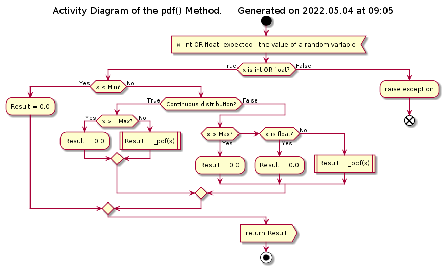

The *public* method *cdf*() accepts any real number as its only argument. For the values less than the low bound of the interval supported by the distribution it returns 0, for the values greater than the max bound it returns 1, otherwise it calls the *private* method *_cdf*(), which is not defined in the class itself, and it MUST be defined in the sub-classes.

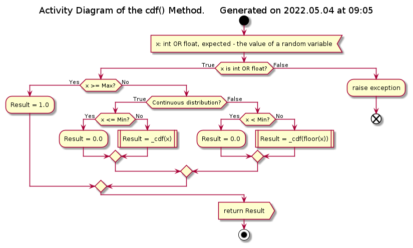

The public method *qf*() accepts any floating point value in the interval (0, 1), otherwise an exception is raised. Then it simply calls the *private* method *_qf*(). The prototype class provides a default implementation of that method based on a bi-section methods (see later in the text), however, the sub-classes re-define that private method if there is a simple expression for the ICDF / QF in terms of analytical or *special* functions (see design document [DE003](../Design/DE003_special_functions.md)).

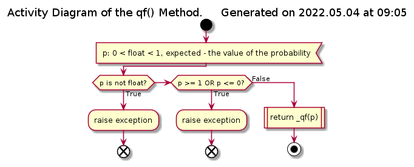

The public method *getQuantile*() performs sanity checks on the input arguments 0 < k:int < m:int and wraps the call of the method *qf*(k/m).

The public method *getHistogram*() calculates the *expected* histrogram (normalized to the number of points) of the distribution of a sample of random values assuming that the population is distribution with this model.

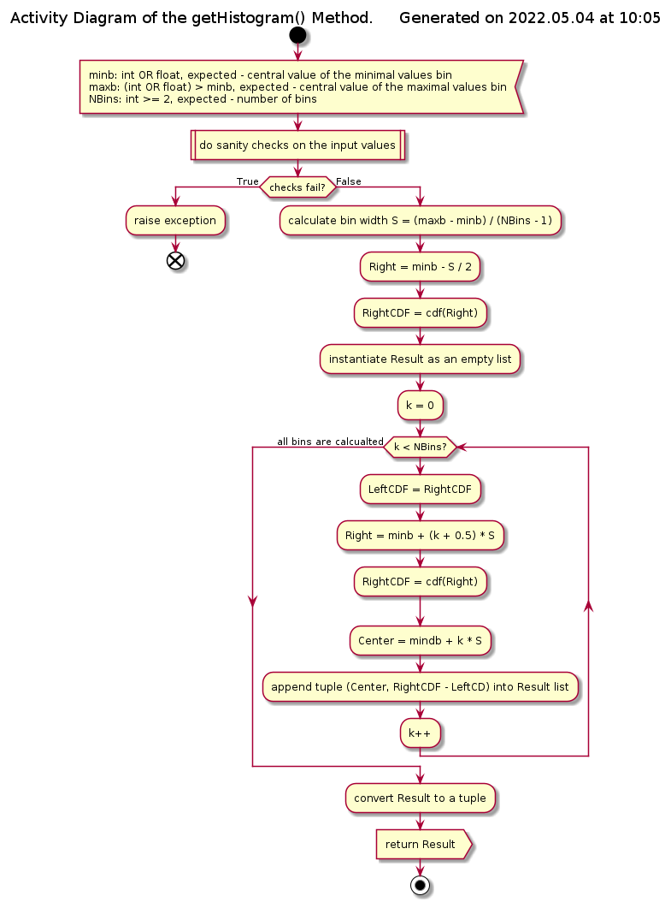

Each call to the method *random*() returns a single random value, which is pulled from a population distributed following a specific model. Under the hood, it performs transformation of the interval (0, 1) into the range of the supported by the distribution values using the QF.

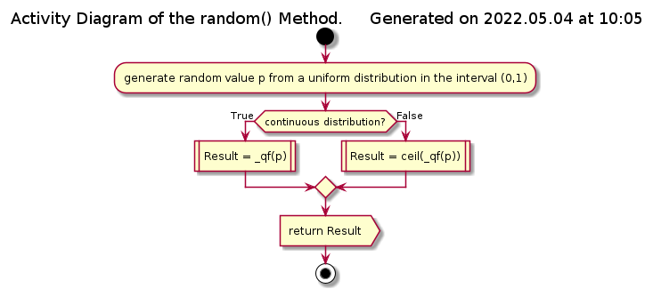

In addition, the prototype class **ContinuousDistributionABC** defines getter properties *Median*, *Q1* and *Q3* via calls to the method *qf*(0.5), *qf*(0.25) and *qf*(0.75) respectively. The distributions with simple analytical expressions for these values re-define the respective properties. It also defines *Sigma* getter property as a square root of the (yet abstract) getter property *Var*. The rest of the properties are defined as *abstract* and MUST be re-implemented in the sub-classes.

The default implementation of the *private* method *_qf*() is based on the bi-section algorithm with few adjustments:

* the initial lower and upper search bounds are not known *a priori*, and must be found first
* either or both of the bounds of the values upon which the function is defined can be infinite

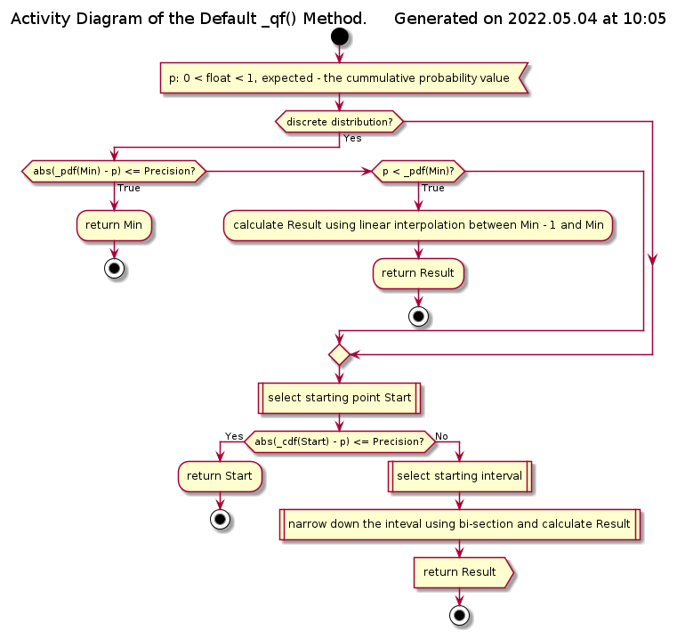

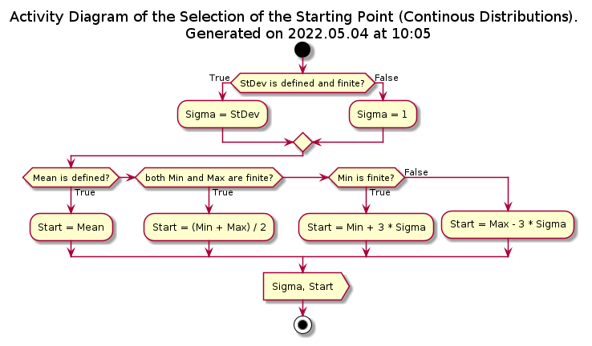

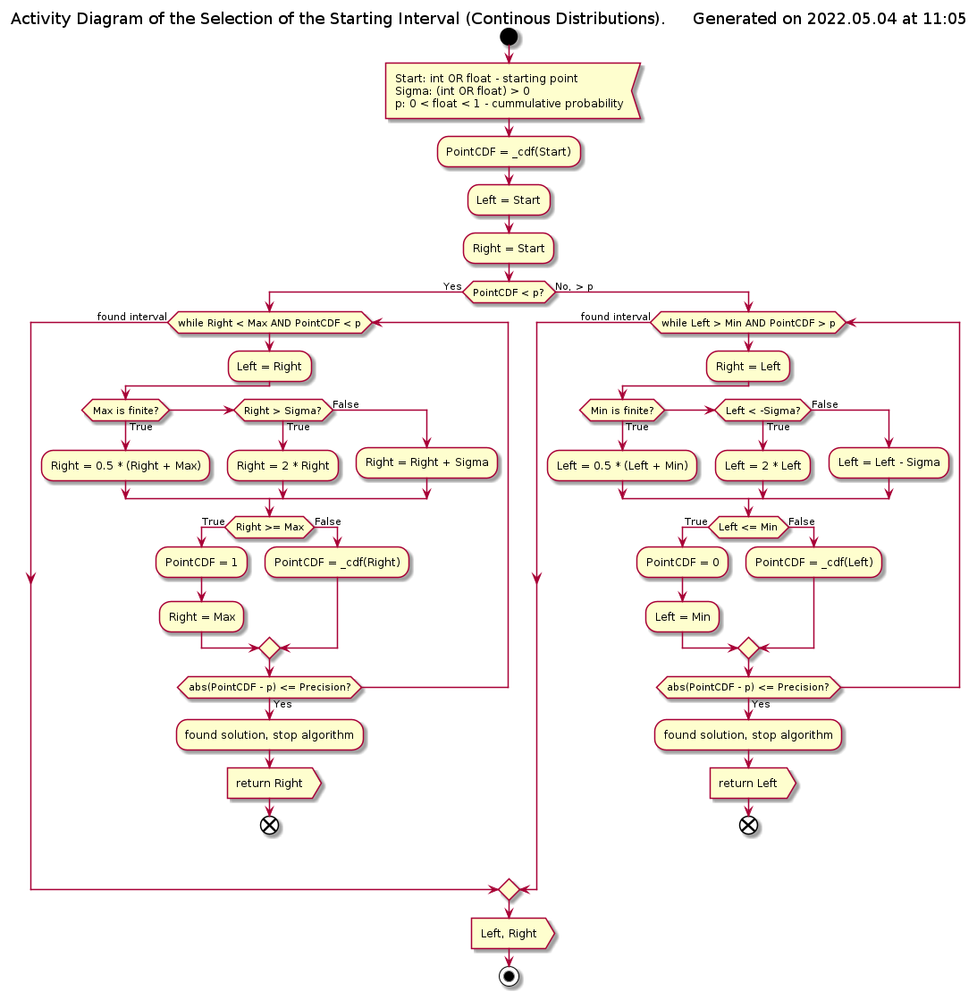

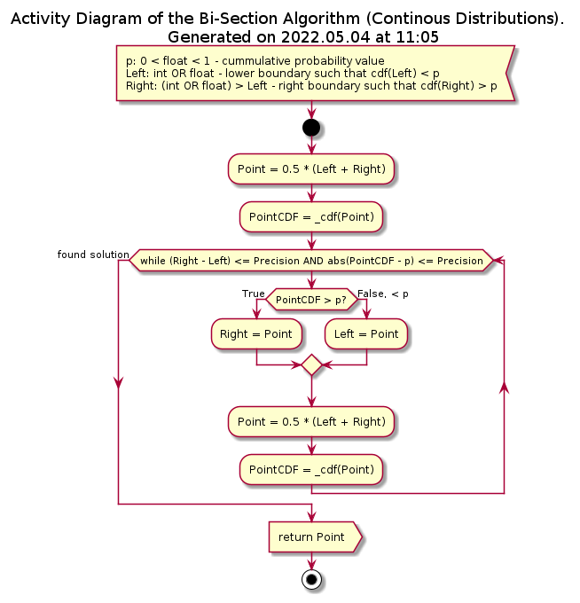

The *Precision* parameter is set to 1.0E-8.

The discrete distributions are not direct children of the prototype class **ContinuousDistributionABC** but of its sub-class (also abstract prototype) **DiscreteDistributionABC**. This second prototype class introduces the following modifications:

* *pdf*() method returns non-zero values only for the integer intput values within the supported values interval
* *cdf*() method implements *step-function* with the constant values between the consecutive integers within the supported values interval
* methods *qf*() and *_qf*() take into account that *pdf*() and *cdf*() are meaningfull only for the integer values (see diagrams below), thus the bi-section is terminated as soon as the search interval is limited by two consecutive integer values (N and N + 1), and uses linear interpolation / extrapolation as the estimator of the *true* quantile value
* method *random*() returns only integer numbers

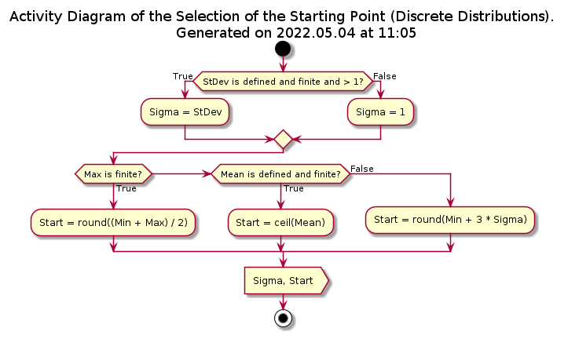

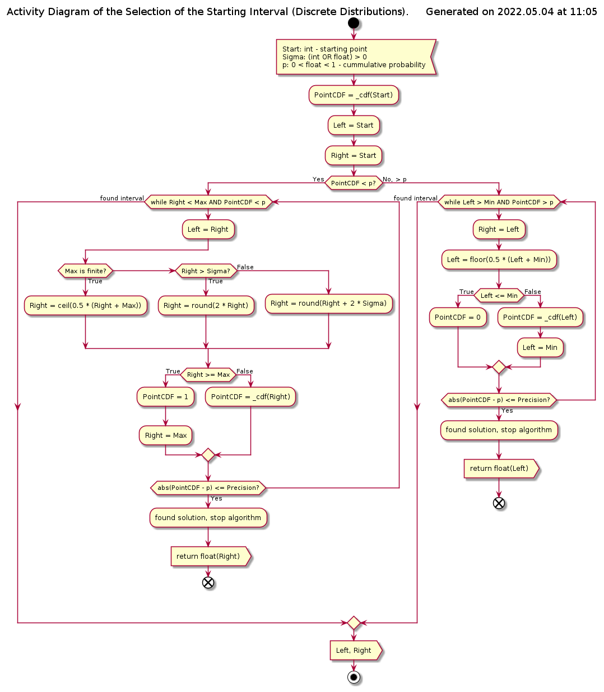

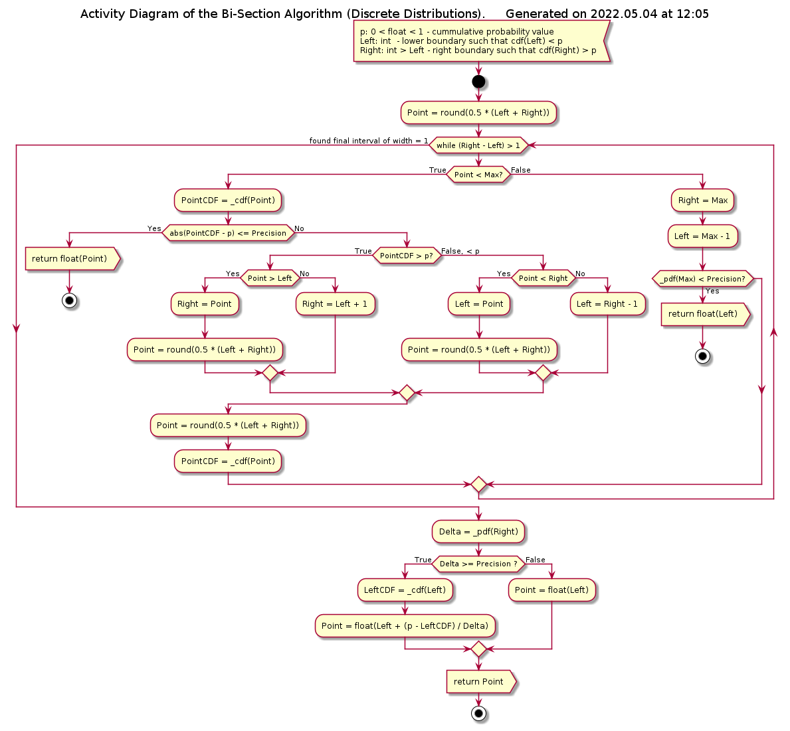

The specific implementation classes define the *private* methods *_pdf*() and *_cdf*(), the public getter properties for the statistical properties of the distribution, getter / setter properties for the parameters of the distribution and the instantiation method. Note that the setter properties and the instantiation method also implement input data sanity checks. In addition, some classes also re-define the *private* method *_qf*() and the getter properties *Median*, *Q1* and *Q3*.

## API Reference

All classes described below have exactly the same set of public methods with exactly the same signature, as given below, but they differ in the amount and types of the properties.

### Common public methods

***pdf***(x)

*Signature*:

**int** OR **float** -> **float** >= 0

*Raises*:

**UT_TypeError**: the argument is not a real number

*Description*:

Calculates the probability density function / probability mass function for the given value x of the random variable X, which is the shape of the distribution.

***cdf***(x)

*Signature*:

**int** OR **float** -> 0.0 <= **float** <= 1.0

*Raises*:

**UT_TypeError**: the argument is not a real number

*Description*:

Calculates the cummulative distribution function for the given value x of the random variable X, i.e. Pr[X <= x].

***qf***(p)

*Signature*:

0.0 < **float** < 1.0 -> **int** OR **float**

*Raises*:

* **UT_TypeError**: the argument is not a floating point number
* **UT_ValueError**: the argument is not in the range (0, 1)

*Description*:

Calculates the inverse cummulative distribution function, a.k.a. quantile function, i.e the value x of the random variable X for which the p = Pr[X <= x], where p is the passed probability value.

***getQuantile***(k, m)

*Signature*:

**int** > 0, **int** > 0 -> **int** OR **float**

*Args*:

* *k*: **int** > 0; the quantile index
* *m*: **int** > 0; the total number of quantiles

*Raises*:

* **UT_TypeError**: either of the arguments is not an integer number
* **UT_ValueError**: first argument is not positive, OR it is greater than or equal to the second argument

*Description*:

Calculates the k-th of m-quantile, where 0 < k < m, which is a short-hand for *qf*(k/m).

***random***()

*Signature*:

**None** -> **int** OR **float**

*Description*:

Generates a random value from the distribution.

***getHistogram***(minb, maxb, NBins)

*Signature*:

**int** OR **float**, **int** OR **float**, **int** > 1 -> **tuple**(**tuple**(**int** OR **float**, **float** >= 0))

*Args*:

* *minb*: **int** OR **float**; the cental value of the minimal values bin
* *maxb*: **int** OR **float**; the cental value of the maximal values bin
* *NBins*: **int** > 1; the number of bins

*Raises*:

* **UT_TypeError**: either min or max argument is not a real number, OR number of bins is not an integer
* **UT_ValueError**: min argument is greater then or equal to max argument, OR number of bins is less than 2

*Description*:

Calculates the (partial) histogram of the distribution using the specified number of bins of the same width, whith the central values of the bins being between the specificed min and max values.

### Class Z_Distribution

Implementation of the Z-distribution, i.e. standard normal (Gaussian with mean = 0 and sigma = 1). Must be instantiated without arguments.

**Properties**:

* *Name*: (read-only) **str**
* *Min*: (read-only) **float** = - math.inf
* *Max*: (read-only) **float** = math.inf
* *Mean*: (read-only) **float** = 0
* *Median*: (read-only) **float** = 0
* *Q1*: (read-only) **float** < 0
* *Q3*: (read-only) **float** > 0
* *Var*: (read-only) **float** = 1.0
* *Sigma*: (read-only) **float** = 1.0
* *Skew*: (read-only) **float** = 0.0
* *Kurt*: (read-only) **float** = 0.0

**Instantiation**:

***\_\_init\_\_***()

*Signature*:

**None** -> **None**

*Description*:

Does nothing.

### Class Gaussian

Implementation of the generic Gaussian distribution. Must be instantiated with two arguments: mean and sigma.

**Properties**:

* *Name*: (read-only) **str**
* *Min*: (read-only) **float** = - math.inf
* *Max*: (read-only) **float** = math.inf
* *Mean*: **int** OR **float**
* *Median*: (read-only) **int** OR **float**
* *Q1*: (read-only) **float**
* *Q3*: (read-only) **float**
* *Var*: (read-only) **int** > 0 OR **float** > 0
* *Sigma*: **int** > 0 OR **float** > 0
* *Skew*: (read-only) **float** = 0.0
* *Kurt*: (read-only) **float** = 0.0

**Instantiation**:

***\_\_init\_\_***(Mean, Sigma)

*Signature*:

**int** OR **float**, **int** > 0 OR **float** > 0 -> **None**

*Args*:

* *Mean*: **int** OR **float**; the mean parameter of the distribution
* *Sigma*: **int** > 0 OR **float** > 0; the sigma parameter of the distribution

*Raises*:

* **UT_TypeError**: any of the passed values is not a real number
* **UT_ValueError**: sigma value is not positive

*Description*:

Sets the parameters of the distribution.

### Class Exponential

Implementation of the exponential distribution. Must be instantiated with a single positive real number argument.

**Properties**:

* *Name*: (read-only) **str**
* *Min*: (read-only) **int** = 0
* *Max*: (read-only) **float** = math.inf
* *Mean*: (read-only) **float** > 0
* *Median*: (read-only) **float** > 0
* *Q1*: (read-only) **float** > 0
* *Q3*: (read-only) **float** > 0
* *Var*: (read-only) **float** > 0
* *Sigma*: (read-only) **float** > 0
* *Skew*: (read-only) **float** > 0
* *Kurt*: (read-only) **float** > 0
* *Rate*: **int** > 0 OR **float** > 0

**Instantiation**:

***\_\_init\_\_***(Rate)

*Signature*:

**int** > 0 OR **float** > 0 -> **None**

*Raises*:

* **UT_TypeError**: the argument is neither int nor float
* **UT_ValueError**: the argument is zero or negative

*Description*:

Set the single parameter of the distribution - the positive rate.

### Class Student

Implementation of the Student's t-distribution. Must be instantiated with a single positive real number argument.

**Properties**:

* *Name*: (read-only) **str**
* *Min*: (read-only) **float** = - math.inf
* *Max*: (read-only) **float** = math.inf
* *Mean*: (read-only) **int** = 0 OR **None**
* *Median*: (read-only) **int** = 0
* *Q1*: (read-only) **float** < 0
* *Q3*: (read-only) **float** > 0
* *Var*: (read-only) **float** > 0 OR **None**
* *Sigma*: (read-only) **float** > 0 OR **None**
* *Skew*: (read-only) **int** = 0 OR **None**
* *Kurt*: (read-only) **float** > 0 OR **None**
* *Degree*: **int** > 0 OR **float** > 0

**Instantiation**:

***\_\_init\_\_***(Degree)

*Signature*:

**int** > 0 OR **float** > 0 -> **None**

*Raises*:

* **UT_TypeError**: the argument is neither int nor float
* **UT_ValueError**: the argument is zero or negative

*Description*:

Set the single parameter of the distribution - the positive number as the number of degrees of freedom (not necessarily an integer).

### Class ChiSquared

Implementation of the chi-squared distribution. Must be instantiated with a single positive real number argument.

**Properties**:

* *Name*: (read-only) **str**
* *Min*: (read-only) **float** >= 0
* *Max*: (read-only) **float** = math.inf
* *Mean*: (read-only) **int** > 0 OR **float** > 0
* *Median*: (read-only) **int** > 0 OR **float** > 0
* *Q1*: (read-only) **int** > 0 OR **float** > 0
* *Q3*: (read-only) **int** > 0 OR **float** > 0
* *Var*: (read-only) **int** > 0 OR **float** > 0
* *Sigma*: (read-only) **float** > 0
* *Skew*: (read-only) **float** > 0
* *Kurt*: (read-only) **float** > 0
* *Degree*: **int** > 0 OR **float** > 0

**Instantiation**:

***\_\_init\_\_***(Degree)

*Signature*:

**int** > 0 OR **float** > 0 -> **None**

*Raises*:

* **UT_TypeError**: the argument is neither int nor float
* **UT_ValueError**: the argument is zero or negative

*Description*:

Set the single parameter of the distribution - the positive number as the number of degrees of freedom (not necessarily an integer).

### Class F_Distribution

Implementation of the F-distribution. Must be instantiated with two positive real number arguments - degrees of freedom.

**Properties**:

* *Name*: (read-only) **str**
* *Min*: (read-only) **float** >= 0
* *Max*: (read-only) **float** = math.inf
* *Mean*: (read-only) **float** > 0 OR **None**
* *Median*: (read-only) **float** > 0
* *Q1*: (read-only) **float** > 0
* *Q3*: (read-only) **float** > 0
* *Var*: (read-only) **float** > 0 OR **None**
* *Sigma*: (read-only) **float** > 0 OR **None**
* *Skew*: (read-only) **float** > 0 OR **None**
* *Kurt*: (read-only) **float** > 0 OR **None**
* *Degree1*: **int** > 0 OR **float** > 0
* *Degree2*: **int** > 0 OR **float** > 0

**Instantiation**:

***\_\_init\_\_***(Degree1, Degree2)

*Signature*:

**int** > 0 OR **float** > 0, **int** > 0 OR **float** > 0 -> **None**

*Args*:

* *Degree1*: **int** > 0 OR **float** > 0; the first parameter of the distribution as the degree of freedom
* *Degree2*: **int** > 0 OR **float** > 0; the second parameter of the distribution as the degree of freedom

*Raises*:

* **UT_TypeError**: either of the arguments is neither int nor float
* **UT_ValueError**: either of the arguments is zero or negative

*Description*:

Set the both parameters of the distribution - the positive numbers as the number of degrees of freedom (not necessarily integers).

### Class Gamma

Implementation of the Gamma distribution. Must be instantiated with two positive real number arguments - shape and rate.

**Properties**:

* *Name*: (read-only) **str**
* *Min*: (read-only) **float** > 0
* *Max*: (read-only) **float** = math.inf
* *Mean*: (read-only) **float** > 0
* *Median*: (read-only) **float** > 0
* *Q1*: (read-only) **float** > 0
* *Q3*: (read-only) **float** > 0
* *Var*: (read-only) **float** > 0
* *Sigma*: (read-only) **float** > 0
* *Skew*: (read-only) **float** > 0
* *Kurt*: (read-only) **float** > 0
* *Shape*: **int** > 0 OR **float** > 0
* *Rate*: **int** > 0 OR **float** > 0

**Instantiation**:

***\_\_init\_\_***(Shape, Rate)

*Signature*:

**int** > 0 OR **float** > 0, **int** > 0 OR **float** > 0 -> **None**

*Args*:

* *Shape*: **int** > 0 OR **float** > 0; the shape parameter of the distribution
* *Rate*: **int** > 0 OR **float** > 0; the rate parameter of the distribution

*Raises*:

* **UT_TypeError**: either of the arguments is neither int nor float
* **UT_ValueError**: either of the arguments is zero or negative

*Description*:

Set the shape and rate parameters of the distribution.

### Class Erlang

Implementation of the Erlang distribution. Must be instantiated with a positive integer argument - shape, and a positive real number argument - rate.

**Properties**:

* *Name*: (read-only) **str**
* *Min*: (read-only) **float** = 0
* *Max*: (read-only) **float** = math.inf
* *Mean*: (read-only) **float** > 0
* *Median*: (read-only) **float** > 0
* *Q1*: (read-only) **float** > 0
* *Q3*: (read-only) **float** > 0
* *Var*: (read-only) **float** > 0
* *Sigma*: (read-only) **float** > 0
* *Skew*: (read-only) **float** > 0
* *Kurt*: (read-only) **float** > 0
* *Shape*: **int** > 0
* *Rate*: **int** > 0 OR **float** > 0

**Instantiation**:

***\_\_init\_\_***(Shape, Rate)

*Signature*:

**int** > 0, **int** > 0 OR **float** > 0 -> **None**

*Args*:

* *Shape*: **int** > 0; the shape parameter of the distribution
* *Rate*: **int** > 0 OR **float** > 0; the rate parameter of the distribution

*Raises*:

* **UT_TypeError**: the first argument is not an integer, OR the second argument is neither integer nor float
* **UT_ValueError**: either of the arguments is zero or negative

*Description*:

Set the shape and rate parameters of the distribution.

### Class Poisson

Implementation of the Poisson distribution. Must be instantiated with a positive integer or floating point number argument - rate.

**Properties**:

* *Name*: (read-only) **str**
* *Min*: (read-only) **int** = 0
* *Max*: (read-only) **float** = math.inf
* *Mean*: (read-only) **int** > 0 OR **float** > 0
* *Median*: (read-only) **float** > 0
* *Q1*: (read-only) **float** > 0
* *Q3*: (read-only) **float** > 0
* *Var*: (read-only) **int** > 0 OR **float** > 0
* *Sigma*: (read-only) **float** > 0
* *Skew*: (read-only) **float** > 0
* *Kurt*: (read-only) **float** > 0
* *Rate*: **int** > 0 OR **float** > 0

**Instantiation**:

***\_\_init\_\_***(Rate)

*Signature*:

**int** > 0 OR **float** > 0 -> **None**

*Raises*:

* **UT_TypeError**: the argument is neither int nor float
* **UT_ValueError**: the argument is zero or negative

*Description*:

Set the rate parameter of the distribution.

### Class Binomial

Implementation of the binomial distribution. Must be instantiated with a floating point number argument - probabilty - in the range (0, 1), and a positive integer argument - draws.

**Properties**:

* *Name*: (read-only) **str**
* *Min*: (read-only) **int** = 0
* *Max*: (read-only) **int** > 0
* *Mean*: (read-only) **float** > 0
* *Median*: (read-only) **float** > 0
* *Q1*: (read-only) **float** > 0
* *Q3*: (read-only) **float** > 0
* *Var*: (read-only) **float** > 0
* *Sigma*: (read-only) **float** > 0
* *Skew*: (read-only) **float**
* *Kurt*: (read-only) **float**
* *Draws*: **int** > 0
* *Probability*: 0 < **float** < 1

**Instantiation**:

***\_\_init\_\_***(Probability, Draws)

*Signature*:

0 < **float** < 1, **int** > 0 -> **None**

*Args*:

* *Probability*: 0 < **float** < 1; the probability parameter of the distribution
* *Draws*: **int** > 0; the number of draws

*Raises*:

* **UT_TypeError**: the first argument is not float, OR the second argument is not int
* **UT_ValueError**: either of the arguments is zero or negative, OR probability is greater than or equal to 1

*Description*:

Set the probability and draws parameters of the distribution.

### Class Geometric

Implementation of the geometric distribution. Must be instantiated with a floating point number argument - probabilty - in the range (0, 1).

**Properties**:

* *Name*: (read-only) **str**
* *Min*: (read-only) **int** = 1
* *Max*: (read-only) **float** = math.inf
* *Mean*: (read-only) **float** > 0
* *Median*: (read-only) **float** > 0
* *Q1*: (read-only) **float** > 0
* *Q3*: (read-only) **float** > 0
* *Var*: (read-only) **float** > 0
* *Sigma*: (read-only) **float** > 0
* *Skew*: (read-only) **float** > 0
* *Kurt*: (read-only) **float** > 0
* *Probability*: 0 < **float** < 1

**Instantiation**:

***\_\_init\_\_***(Probability)

*Signature*:

0 < **float** < 1 -> **None**

*Raises*:

* **UT_TypeError**: the argument is not float
* **UT_ValueError**: the argument is not in the range (0, 1)

*Description*:

Set the probability parameter of the distribution.

### Class Hypergeometric

Implementation of the hypergeometric distribution. Must be instantiated with threee positive integer numbers: population size N, number of all successes within the population K, and number of draws made n - where 0 < n < N and 0 < K < N; hence, N >= 2.

**Properties**:

* *Name*: (read-only) **str**
* *Min*: (read-only) **int** >= 0
* *Max*: (read-only) **int** > 0
* *Mean*: (read-only) **int** > 0 OR **float** > 0
* *Median*: (read-only) **float** > 0
* *Q1*: (read-only) **float** > 0
* *Q3*: (read-only) **float** > 0
* *Var*: (read-only) **float** > 0
* *Sigma*: (read-only) **float** > 0
* *Skew*: (read-only) **float**
* *Kurt*: (read-only) **float**
* *Size*: **int** >= 2
* *Successes*: 0 < **int** < *Size*
* *Draws*: 0 < **int** < *Size*

**Instantiation**:

***\_\_init\_\_***(Size, Successes, Draws)

*Signature*:

**int** > 1, **int** > 0, **int** > 0 -> **None**

*Args*:

* *Size*: **int** >= 2; the size parameter of the distribution
* *Successes*: 0 < **int** < *Size*; the number of the success items in the distribution
* *Draws*: 0 < **int** < *Size*; the number of draws from the population

*Raises*:

* **UT_TypeError**: either of the arguments is not int
* **UT_ValueError**: the first argument is less than 2, OR the second or the third argument is less than 1, OR the second or the third argument is greater than or equal to the first

*Description*:

Set the size, number of successes and number of draws parameters of the distribution.
