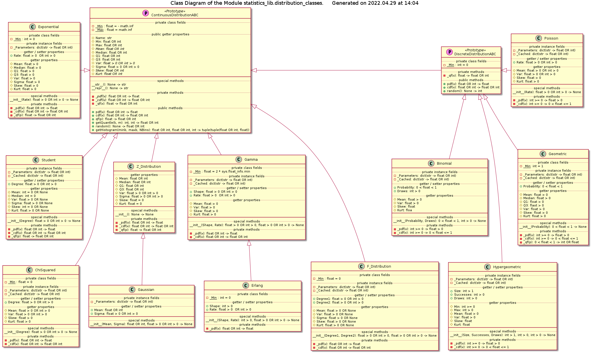

# Module statistics_lib.distribution_classes Reference

## Scope

This document describes the intended usage, design and implementation of the functionality implemented in the module **distribution_classes** of the library **statistics_lib**. The API reference is also provided.

The concerted functional elements are classes:

* **Z_Distribution**
* **Gaussian**
* **Exponential**
* **Student**
* **ChiSquared**
* **F_Distribution**
* **Gamma**
* **Erlang**
* **Poisson**
* **Binomial**
* **Geometric**
* **Hypergeometric**

## Intended Use and Functionality

## Design and Implementation

The class diagram of the module is shown below.

## API Reference

### Class Z_Distribution

### Class Gaussian

### Class Exponential

### Class Student

### Class ChiSquared

### Class F_Distribution

### Class Gamma

### Class Erlang

### Class Poisson

### Class Binomial

### Class Geometric

### Class Hypergeometric
