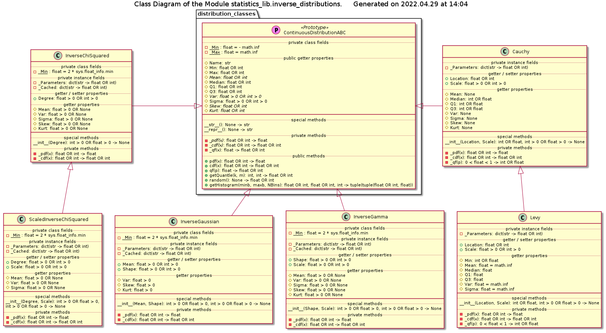

# Module statistics_lib.inverse_distributions Reference

## Scope

This document describes the intended usage, design and implementation of the functionality implemented in the module **inverse_distributions** of the library **statistics_lib**. The API reference is also provided.

The concerted functional elements are classes:

* **InverseGaussian**
* **InverseGamma**
* **InverseChiSquared**
* **ScaledInverseChiSquared**
* **Cauchy**
* **Levy**

## Intended Use and Functionality

This module implements a number of continuous random values distributions, as described in the design document [DE004](../Design/DE004_inverse_distributions.md), which represent distribution of the random values defined as (division) reciprocal of another random variable, or as a ratio of two randomly distributed variables.

Each distribution is implemented as a *class* using object-oriented programming paradigm. All distributions are *parametric*, with the parameters of the distribution being defined during instantiation of the respective class. The parameter(s) of a distribution can be changed at any time via the respective *setter properties*.

All classes have nearly identical API, except for the initialization method and few setter properties, which includes:

* public instance methods for:
  * calculation of the *probability density function* (PDF) for a given value of a random variable - method *pdf*()
  * calculation of the *cummulative probability function* (CDF) for a given value of a random variable - method *cdf*()
  * calculation of the *quantile function* (QF), a.k.a. *inverse cummulative probability function* (ICDF) for a given probability value - method *qf*()
  * calculation of an arbitrary k-th of m-quantile (0 < k < m) - method *getQuantile*()
  * calculation of the *expected* histogram of the distribution of the random values pulled from this distribution - method *getHistogram*()
  * generation of the random values distrubuted following this distribution - method *random*()
* public *getter properties* for:
  * *Min* and *Max* values of an interval, upon which the distribution is defined
  * Statistical properties of the distribution as: *Mean*, *Var* (variance), *Sigma* (standard deviation), *Skew* (skewness) and *Kurt* (excess kurtosis)
  * *Median*, *Q1* (the first quartile) and *Q3* (the third quartile) of the distribution
* class-dependent *setter properties* for the parameters of the distribution

Note that the moment-related statistical properties can be not defined (represented by **None** value) or indefinite $\infin$ (represented by **math.inf** value) in some cases. The indefinite *Max* $+\infin$ boundary is represented by **math.inf** value.  The indefinite *Min* $-\infin$ boundary is represented by **-math.inf** value, whereas an open zero interval for the *Min* boundary is represented by the **2 \* sys.float_info.min** value ($\approx$ 4.45E-308).

This functionality allows direct comparison of the shape and stastical properties of an *experimentally obtained sample* with those of a model distribution, which the observed values are expected to follow. Additionally, these classes can be used in the Monte-Carly simulations.

## Design and Implementation

The class diagram of the module is shown below.

The specific implementations of the distributions sub-class the *abstract* prototype class **ContinuousDisctributionABC* from the module *distribution_classes* (see [UD004](./UD004_distribution_classes.md) document), which defines the common functionality for all children classes.

## API Reference

All classes described below have exactly the same set of public methods with exactly the same signature, as given below, but they differ in the amount and types of the properties.

### Common public methods

***pdf***(x)

*Signature*:

**int** OR **float** -> **float** >= 0

*Raises*:

**UT_TypeError**: the argument is not a real number

*Description*:

Calculates the probability density function / probability mass function for the given value x of the random variable X, which is the shape of the distribution.

***cdf***(x)

*Signature*:

**int** OR **float** -> 0.0 <= **float** <= 1.0

*Raises*:

**UT_TypeError**: the argument is not a real number

*Description*:

Calculates the cummulative distribution function for the given value x of the random variable X, i.e. Pr[X <= x].

***qf***(p)

*Signature*:

0.0 < **float** < 1.0 -> **int** OR **float**

*Raises*:

* **UT_TypeError**: the argument is not a floating point number
* **UT_ValueError**: the argument is not in the range (0, 1)

*Description*:

Calculates the inverse cummulative distribution function, a.k.a. quantile function, i.e the value x of the random variable X for which the p = Pr[X <= x], where p is the passed probability value.

***getQuantile***(k, m)

*Signature*:

**int** > 0, **int** > 0 -> **int** OR **float**

*Args*:

* *k*: **int** > 0; the quantile index
* *m*: **int** > 0; the total number of quantiles

*Raises*:

* **UT_TypeError**: either of the arguments is not an integer number
* **UT_ValueError**: first argument is not positive, OR it is greater than or equal to the second argument

*Description*:

Calculates the k-th of m-quantile, where 0 < k < m, which is a short-hand for *qf*(k/m).

***random***()

*Signature*:

**None** -> **int** OR **float**

*Description*:

Generates a random value from the distribution.

***getHistogram***(minb, maxb, NBins)

*Signature*:

**int** OR **float**, **int** OR **float**, **int** > 1 -> **tuple**(**tuple**(**int** OR **float**, **float** >= 0))

*Args*:

* *minb*: **int** OR **float**; the cental value of the minimal values bin
* *maxb*: **int** OR **float**; the cental value of the maximal values bin
* *NBins*: **int** > 1; the number of bins

*Raises*:

* **UT_TypeError**: either min or max argument is not a real number, OR number of bins is not an integer
* **UT_ValueError**: min argument is greater then or equal to max argument, OR number of bins is less than 2

*Description*:

Calculates the (partial) histogram of the distribution using the specified number of bins of the same width, whith the central values of the bins being between the specificed min and max values.

### Class InverseGaussian

Implementation of the inverse Gaussian distribution. Must be instantiated with two positive real number arguments: mean and shape.

**Properties**:

* *Name*: (read-only) **str**
* *Min*: (read-only) **float** >= 0
* *Max*: (read-only) **float** = math.inf
* *Mean*: **int** > 0 OR **float** > 0
* *Median*: (read-only) **float** > 0
* *Q1*: (read-only) **float** > 0
* *Q3*: (read-only) **float** > 0
* *Var*: (read-only) **float** > 0
* *Sigma*: (read-only) **float** > 0
* *Skew*: (read-only) **float** > 0
* *Kurt*: (read-only) **float** > 0
* *Shape*: **int** > 0 OR **float** > 0

**Instantiation**:

***\_\_init\_\_***(Mean, Shape)

*Signature*:

**int** > 0 OR **float** > 0, **int** > 0 OR **float** > 0 -> **None**

*Args*:

* *Mean*: **int** > 0 OR **float** > 0; the mean (location) parameter of the distribution
* *Shape*: **int** > 0 OR **float** > 0; the shape parameter of the distribution

*Raises*:

* **UT_TypeError**: any of the passed values is not a real number
* **UT_ValueError**: any of the passed values is not positive

*Description*:

Sets the parameters of the distribution.

### Class InverseGamma

Implementation of the inverse Gamma distribution. Must be instantiated with two positive real number arguments: shape and scale.

**Properties**:

* *Name*: (read-only) **str**
* *Min*: (read-only) **float** > 0
* *Max*: (read-only) **float** = math.inf
* *Mean*: (read-only) **float** > 0 OR **None**
* *Median*: (read-only) **float** > 0
* *Q1*: (read-only) **float** > 0
* *Q3*: (read-only) **float** > 0
* *Var*: (read-only) **float** > 0 OR **None**
* *Sigma*: (read-only) **float** > 0 OR **None**
* *Skew*: (read-only) **float** > 0 OR **None**
* *Kurt*: (read-only) **float** > 0 OR **None**
* *Shape*: **int** > 0 OR **float** > 0
* *Scale*: **int** > 0 OR **float** > 0

**Instantiation**:

***\_\_init\_\_***(Shape, Scale)

*Signature*:

**int** > 0 OR **float** > 0, **int** > 0 OR **float** > 0 -> **None**

*Args*:

* *Shape*: **int** > 0 OR **float** > 0; the shape parameter of the distribution
* *Scale*: **int** > 0 OR **float** > 0; the shape parameter of the distribution

*Raises*:

* **UT_TypeError**: any of the passed values is not a real number
* **UT_ValueError**: any of the passed values is not positive

*Description*:

Sets the parameters of the distribution.

### Class InverseChiSquared

Implementation of the inverse chi-squared distribution. Must be instantiated with a positive real number argument - degree of freedom.

**Properties**:

* *Name*: (read-only) **str**
* *Min*: (read-only) **float** > 0
* *Max*: (read-only) **float** = math.inf
* *Mean*: (read-only) **float** > 0 OR **None**
* *Median*: (read-only) **float** > 0
* *Q1*: (read-only) **float** > 0
* *Q3*: (read-only) **float** > 0
* *Var*: (read-only) **float** > 0 OR **None**
* *Sigma*: (read-only) **float** > 0 OR **None**
* *Skew*: (read-only) **float** > 0 OR **None**
* *Kurt*: (read-only) **float** > 0 OR **None**
* *Degree*: **int** > 0 OR **float** > 0

**Instantiation**:

***\_\_init\_\_***(Degree)

*Signature*:

**int** > 0 OR **float** > 0 -> **None**

*Raises*:

* **UT_TypeError**: the argument is neither int nor float
* **UT_ValueError**: the argument is zero or negative

*Description*:

Sets the parameter of the distribution.

### Class ScaledInverseChiSquared

Implementation of the scaled inverse chi-squared distribution. Must be instantiated with two positive real number arguments: degree of freedom and scale.

**Properties**:

* *Name*: (read-only) **str**
* *Min*: (read-only) **float** > 0
* *Max*: (read-only) **float** = math.inf
* *Mean*: (read-only) **float** > 0 OR **None**
* *Median*: (read-only) **float** > 0
* *Q1*: (read-only) **float** > 0
* *Q3*: (read-only) **float** > 0
* *Var*: (read-only) **float** > 0 OR **None**
* *Sigma*: (read-only) **float** > 0 OR **None**
* *Skew*: (read-only) **float** > 0 OR **None**
* *Kurt*: (read-only) **float** > 0 OR **None**
* *Degree*: **int** > 0 OR **float** > 0
* *Scale*: **int** > 0 OR **float** > 0

**Instantiation**:

***\_\_init\_\_***(Degree, Scale)

*Signature*:

**int** > 0 OR **float** > 0, **int** > 0 OR **float** > 0 -> **None**

*Args*:

* *Degree*: **int** > 0 OR **float** > 0; the degree of freedom parameter of the distribution
* *Scale*: **int** > 0 OR **float** > 0; the shape parameter of the distribution

*Raises*:

* **UT_TypeError**: any of the passed values is not a real number
* **UT_ValueError**: any of the passed values is not positive

*Description*:

Sets the parameters of the distribution.

### Class Cauchy

Implementation of the Cauchy distribution. Must be instantiated with two real number arguments: location and scale, whereas the scale must be positive.

**Properties**:

* *Name*: (read-only) **str**
* *Min*: (read-only) **float** = - math.inf
* *Max*: (read-only) **float** = math.inf
* *Mean*: (read-only) **None**
* *Median*: (read-only) **int** OR **float**
* *Q1*: (read-only) **int** OR **float**
* *Q3*: (read-only) **int** OR **float**
* *Var*: (read-only) **None**
* *Sigma*: (read-only) **None**
* *Skew*: (read-only) **None**
* *Kurt*: (read-only) **None**
* *Location*: **int** OR **float**
* *Scale*: **int** > 0 OR **float** > 0

**Instantiation**:

***\_\_init\_\_***(Location, Scale)

*Signature*:

**int** OR **float**, **int** > 0 OR **float** > 0 -> **None**

*Args*:

* *Location*: **int** OR **float** ; the location parameter of the distribution
* *Scale*: **int** > 0 OR **float** > 0; the scale parameter of the distributio

*Raises*:

* **UT_TypeError**: either of the arguments is neither int nor float
* **UT_ValueError**: the scale argument is zero or negative

*Description*:

Sets the parameters of the distribution.

### Class Levy

Implementation of the Levy distribution. Must be instantiated with two real number arguments: location and scale, whereas the scale must be positive.

**Properties**:

* *Name*: (read-only) **str**
* *Min*: (read-only) **int** OR **float**
* *Max*: (read-only) **float** = math.inf
* *Mean*: (read-only) **None**
* *Median*: (read-only) **int** OR **float**
* *Q1*: (read-only) **int** OR **float**
* *Q3*: (read-only) **int** OR **float**
* *Var*: (read-only) **float** = math.inf
* *Sigma*: (read-only) **float** = math.inf
* *Skew*: (read-only) **None**
* *Kurt*: (read-only) **None**
* *Location*: **int** OR **float**
* *Scale*: **int** > 0 OR **float** > 0

**Instantiation**:

***\_\_init\_\_***(Location, Scale)

*Signature*:

**int** OR **float**, **int** > 0 OR **float** > 0 -> **None**

*Args*:

* *Location*: **int** OR **float** ; the location parameter of the distribution
* *Scale*: **int** > 0 OR **float** > 0; the scale parameter of the distributio

*Raises*:

* **UT_TypeError**: either of the arguments is neither int nor float
* **UT_ValueError**: the scale argument is zero or negative

*Description*:

Sets the parameters of the distribution.
