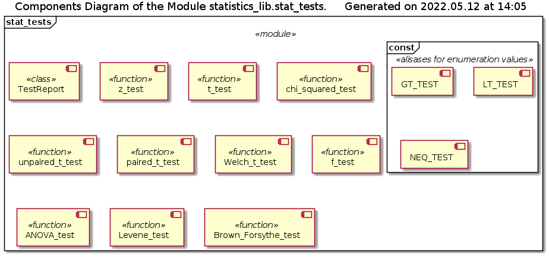
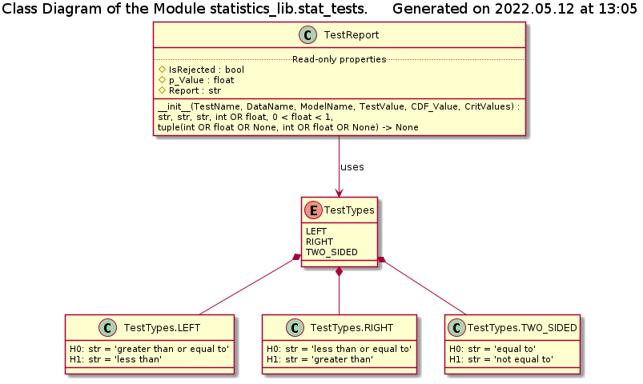

# Module statistics_lib.stat_tests Reference

## Scope

This document describes the intended usage, design and implementation of the functionality implemented in the module **stat_tests** of the library **statistics_lib**. The API reference is also provided.

The concerted functional elements are:

* class **TestReport**
* functions
  * *z_test*()
  * *t_test*()
  * *chi_squared_test*()
  * *unpaired_t_test*()
  * *paired_t_test*()
  * *Welch_t_test*()
  * *f_test*()
  * *ANOVA_test*()
  * *Levene_test*()
  * *Brown_Forsyth_test*()

## Intended Use and Functionality

This module implements the basic statistical significance tests (see [DE005](../Design/DE005_statistical_tests.md) document). Specifically:

* Comparison of the sample's mean with the population's mean
  * Z-test with the known population variance / standard deviation
  * Student's t-test with the unknown population variance / standard deviation
* Comparison of the sample's variance with the population's variance - chi-squared test
* Comparison of the mean values of two samples:
  * Unpaired Student's t-test
  * Paired Student's t-test
  * Welch's t-test
* Comparison of the variance of two samples - F-test
* Homoscedasticity of two samples tests:
  * ANOVA F-test
  * Levene's test
  * Brown-Forsythe test

The user is expected to pass (by reference) the entire data sample(s) into the respective test function, instead of the statistical properties such as mean, variance and / or standard deviation. The functions themselves care for the proper calculation of the proper statistical properties (e.g. - Bessel corrected estimators of the population values from the sample values) as well as to account for the contribution of the measurement uncertainty of each individual value in the sample (if present) into the total sample variance.

## Design and Implementation

The components diagram of the module is shown below

The module's user / client is supposed to 'pack' the data into one or two instances of the class **statistics_lib.data_classes.Statistics1D** (depending on the test class) and pass them as arguments of the respective functions together with an indication of the type of the test (2-sided or 1-side right- / left-tailed), as well as with the mandatory parameters of the test (if there are such). The optional test parameters (when required) can be passed as keyword-only arguments, whereas the confidence level of the test is considered to be such an optional parameter.

All test functions return an instance of the **TestReport** class (see class diagram below), which stores the performed test details and results, and generates a human-readable string report upon request. Instane of this class has only 3 read-only properties and no methods:

* *IsRejected* : True / False - if the test's null hypothesis is rejected
* *p_Value* : the calculated p-value of the test
* *Report* : string, multi-line, human-readable report on the performed test, including the model data distribution, type of the test, input data identificators, calcualted test value and critical values, null and alternative hypothesis, confidence level, etc.

Note, that, except for the ANOVA F-test, Levene and Brown-Forsythe tests, all test functions require the indication of the test type: 2- / 1-sided, right- / left-tailed. This information MUST be indicated by a special data type of the respective argument, which MUST be an enumeration value.

**TestTypes** is, in fact, a *meta-class* implementing an enumeration data type and generating the enumeration values *TestTypes.LEFT*, *TestTypes.RIGHT* and *TestTypes.TWO_SIDED*, which are, technically, objects (instances of sub-classes generated by this meta-class) with two string read-only properties *H0* and *H1* - the null and the alternative hypothesis respectively.

An argument of a function is checked for being one of them using Python's **is** operator. For convenience, these objects are aliased by the module level global variables *LT_TEST*, *GT_TEST* and *NEQ_TEST* respectively.

## API Reference

### Global constants - enumeration type values

The module defines 3 'constants' *GT_TEST*, *LT_TEST* and *NEQ_TEST*, which are to be used as the test type argument *Type* value of all functions, except for the ANOVA F-test, Levene's test and Brown-Forsythe test. These values refer to the 1-sided right-tailed test (alternative hypothesis - greater than), 1-sided left-tailed test (alternative hypothesis - less than) and 2-sided test (alternative hypothesis - not equal). Technically, these 'constants' are aliases for the enumeration instance classes **TestTypes.RIGHT**, **TestTypes.LEFT** and **TestTypes.TWO_SIDED**.

### Class TestReport

Helper class to represent the results of the statistical significance tests. The end-user is not supposed to instantiate this class manually, but only to receive such an instance as the return value of the corresponding function.

***Properties***:

* *IsRejected*: (read-only) **bool**; the total outcome of the test - if the null hypothesis is rejected (**True**) or the test fails to reject the null hypothesis (**False**)
* *p_Value*: (read-only) 0 <= **float** <= 1; the p_Value of the test
* *Report*: (read-only) **str**; the human-readable, multi-line string report on the test

***Instantiation***:

**\_\_init\_\_**(TestName, DataName, ModelName, TestValue, CDF_Value, CritValues)

*Signature*:

str, str, str, int OR float, 0 < float < 1, tuple(int OR float OR None, int OR float OR None) -> None

*Args*:

* *TestName*: **str**; the name of the test, including the parameters and confidence level
* *DataName*: **str**; the identificator of the data set(s)
* *ModelName*: **str**; the name of the class implementing the model distribution, including the parameters
* *TestValue*: **int** or **float**; the calculated test value
* *CDF_Value*: 0 < **float** < 1; the calculated CDF value at the test value
* *CritValues*: **tuple**(**int** OR **float** OR **None**, **int** OR **float** OR **None**); the lower and upper critical values, both cannot be **None** simultaneously

*Raises*:

* **UT_TypeError**: any of the arguments is on an unexpected / wrong data types
* **UT_ValueError**: *CDF_Value* is not in the range (0, 1), OR the upper critical value is not greater than or equal to the lower one

*Description*:

Performs the input data sanity checks and stores the passed data as the object state.

### Functions

**z_test**(Data, Mean, Sigma, Type, \*, Confidence = 0.95)

*Signature*:

Statistics1D, int OR float, int > 0 OR float > 0, TestTypes/, \*, 0 < float < 1/ -> TestResult

*Args*:

* *Data*: **Statistics1D**; instance of, the sampled data stored in an instance of specialized statistical class
* *Mean*: **int** OR **float**; the mean of the population parameter of the model distribution
* *Sigma*: **int** > 0 OR **float** > 0; the standard deviation of the population parameter of the model distribution
* *Type*: **TestTypes**; an enumeration value indicating the 1- or 2-sided nature of the test, use values *GT_TEST*, *LT_TEST* and *NEQ_TEST* defined in this module
* *Confidence*: (keyword) 0 < **float** < 1; the confidence level of test, defaults to 0.95, i.e. 95%.

*Returns*:

**TestResult**: instance of the class (defined in this module), which can generate a human-readable report on the performed test

*Raises*:

* **UT_TypeError**: either of the arguments is of the improper data type
* **UT_ValueError**: *Sigma* argument is zero or negative, OR *Confidence* argument is not in the range (0, 1), OR data sequence is less than 2 elements long

*Description*:

Implementation of the Z-test, comparing the sample's mean with the known population mean. The actual population standard deviation must be known.

**t_test**(Data, Mean, Type, \*, Confidence = 0.95)

*Signature*:

Statistics1D, int OR float, TestTypes/, \*, 0 < float < 1/ -> TestResult

*Args*:

* *Data*: **Statistics1D**; instance of, the sampled data stored in an instance of specialized statistical class
* *Mean*: **int** OR **float**; the mean of the population parameter of the model distribution
* *Type*: **TestTypes**; an enumeration value indicating the 1- or 2-sided nature of the test, use values *GT_TEST*, *LT_TEST* and *NEQ_TEST* defined in this module
* *Confidence*: (keyword) 0 < **float** < 1; the confidence level of test, defaults to 0.95, i.e. 95%.

*Returns*:

**TestResult**: instance of the class (defined in this module), which can generate a human-readable report on the performed test

*Raises*:

* **UT_TypeError**: either of the arguments is of the improper data type
* **UT_ValueError**: *Confidence* argument is not in the range (0, 1), OR data sequence is less than 2 elements long

*Description*:

Implementation of the one sample Student`s t-test, comparing the sample's mean with the known population mean. The actual population standard deviation is unknown.

**chi_squared_test**(Data, Sigma, Type, \*, Confidence = 0.95)

*Signature*:

Statistics1D, int > 0 OR float > 0, TestTypes/, \*, 0 < float < 1/ -> TestResult

*Args*:

* *Data*: **Statistics1D**; instance of, the sampled data stored in an instance of specialized statistical class
* *Sigma*: **int** > 0 OR **float** > 0; the standard deviation of the population parameter of the model distribution
* *Type*: **TestTypes**; an enumeration value indicating the 1- or 2-sided nature of the test, use values *GT_TEST*, *LT_TEST* and *NEQ_TEST* defined in this module
* *Confidence*: (keyword) 0 < **float** < 1; the confidence level of test, defaults to 0.95, i.e. 95%.

*Returns*:

**TestResult**: instance of the class (defined in this module), which can generate a human-readable report on the performed test

*Raises*:

* **UT_TypeError**: either of the arguments is of the improper data type
* **UT_ValueError**: *Sigma* argument is zero or negative, OR *Confidence* argument is not in the range (0, 1), OR data sequence is less than 2 elements long

*Description*:

Implementation of the chi-squared test, comparing the sample's standard deviation with the known population standard deviation.

**unpaired_t_test**(Data1, Data2, Type, \*, Confidence = 0.95)

*Signature*:

Statistics1D, Statistics1D, TestTypes/, \*, 0 < float < 1/ -> TestResult

*Args*:

* *Data1*: **Statistics1D**; instance of, the sampled data stored in an instance of specialized statistical class - the first sample
* *Data2*: **Statistics1D**; instance of, the sampled data stored in an instance of specialized statistical class - the second sample
* *Type*: **TestTypes**; an enumeration value indicating the 1- or 2-sided nature of the test, use values *GT_TEST*, *LT_TEST* and *NEQ_TEST* defined in this module
* *Confidence*: (keyword) 0 < **float** < 1; the confidence level of test, defaults to 0.95, i.e. 95%.

*Returns*:

**TestResult**: instance of the class (defined in this module), which can generate a human-readable report on the performed test

*Raises*:

* **UT_TypeError**: either of the arguments is of the improper data type
* **UT_ValueError**: *Confidence* argument is not in the range (0, 1), OR data sequence is less than 2 elements long

*Description*:

Implementation of the unpaired Student's t-test, comparing the samples' means. The samples's variances are expected to differ no more by 2 times.

**paired_t_test**(Data1, Data2, Type, \*, Confidence = 0.95, Bias = 0.0)

*Signature*:

Statistics1D, Statistics1D, TestTypes/, \*, 0 < float < 1, int OR float/ -> TestResult

*Args*:

* *Data1*: **Statistics1D**; instance of, the sampled data stored in an instance of specialized statistical class - the first sample
* *Data2*: **Statistics1D**; instance of, the sampled data stored in an instance of specialized statistical class - the second sample
* *Type*: **TestTypes**; an enumeration value indicating the 1- or 2-sided nature of the test, use values *GT_TEST*, *LT_TEST* and *NEQ_TEST* defined in this module
* *Confidence*: (keyword) 0 < **float** < 1; the confidence level of test, defaults to 0.95, i.e. 95%.

*Returns*:

**TestResult**: instance of the class (defined in this module), which can generate a human-readable report on the performed test

*Raises*:

* **UT_TypeError**: either of the arguments is of the improper data type
* **UT_ValueError**: *Confidence* argument is not in the range (0, 1), OR data sequence is less than 2 elements long, OR the data samples have unequal lengths

*Description*:

Implementation of the paired Student's t-test, comparing the samples' means. The samples's lengths MUST be equal.

**Welch_t_test**(Data1, Data2, Type, \*, Confidence = 0.95)

*Signature*:

Statistics1D, Statistics1D, TestTypes/, \*, 0 < float < 1/ -> TestResult

*Args*:

* *Data1*: **Statistics1D**; instance of, the sampled data stored in an instance of specialized statistical class - the first sample
* *Data2*: **Statistics1D**; instance of, the sampled data stored in an instance of specialized statistical class - the second samplen
* *Type*: **TestTypes**; an enumeration value indicating the 1- or 2-sided nature of the test, use values *GT_TEST*, *LT_TEST* and *NEQ_TEST* defined in this module
* *Confidence*: (keyword) 0 < **float** < 1; the confidence level of test, defaults to 0.95, i.e. 95%.

*Returns*:

**TestResult**: instance of the class (defined in this module), which can generate a human-readable report on the performed test

*Raises*:

* **UT_TypeError**: either of the arguments is of the improper data type
* **UT_ValueError**: *Confidence* argument is not in the range (0, 1), OR data sequence is less than 2 elements long

*Description*:

Implementation of the Welch t-test, comparing the samples' means. This test is more reliable than the unpaired Student's t-test when the samples's variances differ by more than 2 times.

**f_test**(Data1, Data2, Type, \*, Confidence = 0.95, Delta = 1.0)

*Signature*:

Statistics1D, Statistics1D, TestTypes/, \*, 0 < float < 1, int > 0 OR float > 0/ -> TestResult

*Args*:

* *Data1*: **Statistics1D**; instance of, the sampled data stored in an instance of specialized statistical class - the first sample
* *Data2*: **Statistics1D**; instance of, the sampled data stored in an instance of specialized statistical class - the second sample
* *Type*: **TestTypes**; an enumeration value indicating the 1- or 2-sided nature of the test, use values *GT_TEST*, *LT_TEST* and *NEQ_TEST* defined in this module
* *Confidence*: (keyword) 0 < **float** < 1; the confidence level of test, defaults to 0.95, i.e. 95%.

*Returns*:

**TestResult**: instance of the class (defined in this module), which can generate a human-readable report on the performed test

*Raises*:

* **UT_TypeError**: either of the arguments is of the improper data type
* **UT_ValueError**: *Delta* argument is zero or negative, OR *Confidence* argument is not in the range (0, 1), OR data sequence is less than 2 elements long

*Description*:

Implementation of the f-test, comparing the sample'` standard deviations.

**ANOVA_test**(Data1, Data2, \*, Confidence = 0.95)

*Signature*:

Statistics1D, Statistics1D/, \*, 0 < float < 1/ -> TestResult

*Args*:

* *Data1*: **Statistics1D**; instance of, the sampled data stored in an instance of specialized statistical class - the first sample
* *Data2*: **Statistics1D**; instance of, the sampled data stored in an instance of specialized statistical class - the second sample
* *Confidence*: (keyword) 0 < **float** < 1; the confidence level of test, defaults to 0.95, i.e. 95%.

*Returns*:

**TestResult**: instance of the class (defined in this module), which can generate a human-readable report on the performed test

*Raises*:

* **UT_TypeError**: either of the arguments is of the improper data type
* **UT_ValueError**: *Confidence* argument is not in the range (0, 1), OR data sequence is less than 2 elements long

*Description*:

Implementation of the ANOVA F-test on the homoscedasticity of two samples.

**Levene_test**(Data1, Data2, \*, Confidence = 0.95)

*Signature*:

Statistics1D, Statistics1D/, \*, 0 < float < 1/ -> TestResult

*Args*:

* *Data1*: **Statistics1D**; instance of, the sampled data stored in an instance of specialized statistical class - the first sample
* *Data2*: **Statistics1D**; instance of, the sampled data stored in an instance of specialized statistical class - the second sample
* *Confidence*: (keyword) 0 < **float** < 1; the confidence level of test, defaults to 0.95, i.e. 95%.

*Returns*:

**TestResult**: instance of the class (defined in this module), which can generate a human-readable report on the performed test

*Raises*:

* **UT_TypeError**: either of the arguments is of the improper data type
* **UT_ValueError**: *Confidence* argument is not in the range (0, 1), OR data sequence is less than 2 elements long

*Description*:

Implementation of the Levene test on the homoscedasticity of two samples.

**Brown_Forsythe_test**(Data1, Data2, \*, Confidence = 0.95)

*Signature*:

Statistics1D, Statistics1D/, \*, 0 < float < 1/ -> TestResult

*Args*:

* *Data1*: **Statistics1D**; instance of, the sampled data stored in an instance of specialized statistical class - the first sample
* *Data2*: **Statistics1D**; instance of, the sampled data stored in an instance of specialized statistical class - the second sample
* *Confidence*: (keyword) 0 < **float** < 1; the confidence level of test, defaults to 0.95, i.e. 95%.

*Returns*:

**TestResult**: instance of the class (defined in this module), which can generate a human-readable report on the performed test

*Raises*:

* **UT_TypeError**: either of the arguments is of the improper data type
* **UT_ValueError**: *Confidence* argument is not in the range (0, 1), OR data sequence is less than 2 elements long

*Description*:

Implementation of the Brown-Forsythe test on the homoscedasticity of two samples.
